We have implemented the **FINALLY** ([NeurIPS 2024 paper](https://arxiv.org/abs/2410.05920)), a speech enhancement model designed to improve audio quality in real-world recordings, which often contain various distortions. Our implementation is publicly available on [GitHub](https://github.com/inverse-ai/finally-speech-enhancement), including datasets, augmentations, checkpoints, and demo samples. We welcome contributions to further improve the model and extend its capabilities.

## 1. Introduction
Speech enhancement in real-world environments is challenging due to a wide range of noise types, distortions, and recording conditions. FINALLY addresses these challenges by leveraging advanced feature extraction and training strategies to produce high-quality enhanced speech. The model is suitable for both offline and real-time applications and has been evaluated on several standard datasets to ensure robustness.

## 2. Datasets and Augmentations
We followed the dataset recommendations from the paper, using LibriTTS-R for the first two stages of training, DAPS-clean for stage three, and the DNS dataset for noise augmentation. Additionally, we incorporated high-quality recordings sampled at 48kHz to further improve performance, which provided a modest gain in objective metrics.

For augmentations, we extended the paper's methodology by introducing wind noise and bandwidth limitation. The latter involved downsampling audio to 4kHz and 8kHz, followed by resampling to 16kHz or 48kHz using the model itself. Since the paper did not specify signal-to-noise ratio (SNR) ranges, we experimented with SNR values from -5 dB to 20 dB during training, which helped the model generalize better to various noise levels.

## 3. Loss Functions
We experimented with additional loss functions such as Phoneme loss and eSTOI loss. While these losses improved specific metrics, they introduced trade-offs: improving one score often led to declines in others. Ultimately, we decided to rely on the paper-suggested loss functions, with a single modification. The PESQ loss, originally weighted -2 in the paper, was instead assigned a weight of +2. This adjustment ensures proper loss reduction, aligning the optimization with our goal of minimizing perceptual error.

## 4. Feature Extraction
The paper's analysis indicated that features derived from either the convolutional encoder or the first transformer layer of WavLM were most effective for speech enhancement. In our implementation, we selected the last convolutional layer of WavLM as the feature extractor. Using different layers resulted in noticeable differences in model performance, highlighting the importance of this choice. Proper feature selection ensures that the model captures the most relevant representations for noise reduction and speech clarity.

## 5. Evaluation and Demo
We evaluated FINALLY on the VCTK-Demand dataset. The model achieved improvements across multiple metrics, including UTMOS, DNSMOS, PESQ, STOI, and SDR. While the WV-MOS score was slightly lower than reported in the paper, the overall results demonstrate the model's robustness in realistic conditions.

<table>
  <tr>
    <th>Metric</th>
    <td>UTMOS</td>
    <td>WV-MOS</td>
    <td>DNSMOS</td>
    <td>PESQ</td>
    <td>STOI</td>
    <td>SDR</td>
  </tr>
  <tr>
    <th>Paper's Score</th>
    <td>4.32</td>
    <td>4.87</td>
    <td>3.22</td>
    <td>2.94</td>
    <td>0.92</td>
    <td>4.6</td>
  </tr>
  <tr>
    <th>Our Score</th>
    <td>4.30</td>
    <td>4.62</td>
    <td>3.30</td>
    <td>3.22</td>
    <td>0.95</td>
    <td>6.79</td>
  </tr>
</table>

Below, we present a side-by-side comparison of spectrograms and audio. The left column shows the input speech, while the right column shows the enhanced output.

  

    <h4>Input</h4>
    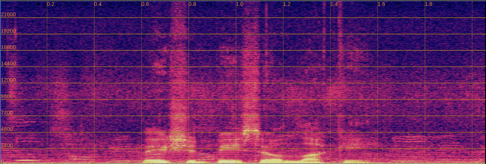
    <audio controls style="width: 100%;">
      <source src="assets/audio/input/p232_028.wav" type="audio/wav">
    </audio>
  

  

    <h4>Enhanced</h4>
    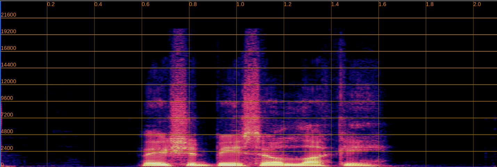
    <audio controls style="width: 100%;">
      <source src="assets/audio/enhanced/p232_028.wav" type="audio/wav">
    </audio>
  

  

    <h4>Input</h4>
    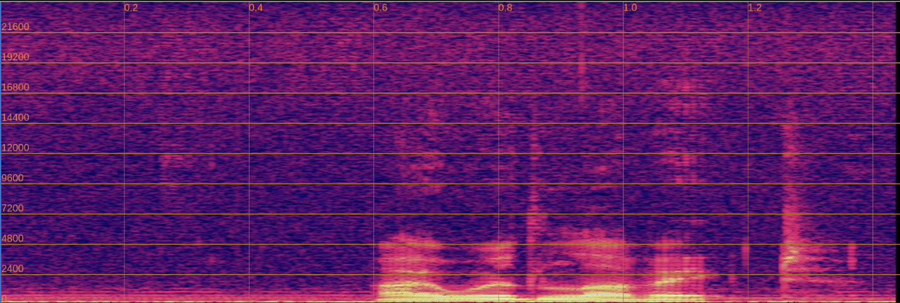
    <audio controls style="width: 100%;">
      <source src="assets/audio/input/p232_033.wav" type="audio/wav">
    </audio>
  

  

    <h4>Enhanced</h4>
    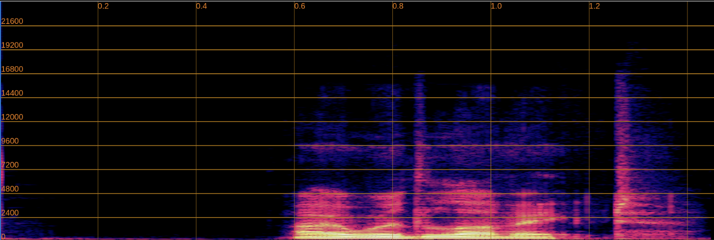
    <audio controls style="width: 100%;">
      <source src="assets/audio/enhanced/p232_033.wav" type="audio/wav">
    </audio>
  

  

    <h4>Input</h4>
    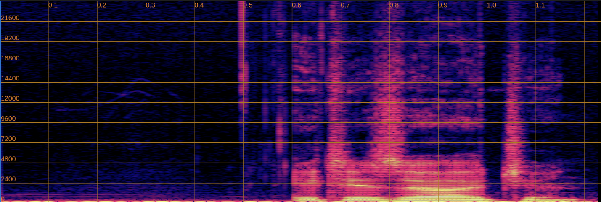
    <audio controls style="width: 100%;">
      <source src="assets/audio/input/p232_045.wav" type="audio/wav">
    </audio>
  

  

    <h4>Enhanced</h4>
    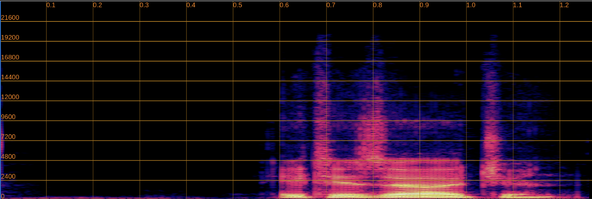
    <audio controls style="width: 100%;">
      <source src="assets/audio/enhanced/p232_045.wav" type="audio/wav">
    </audio>
  

  

    <h4>Input</h4>
    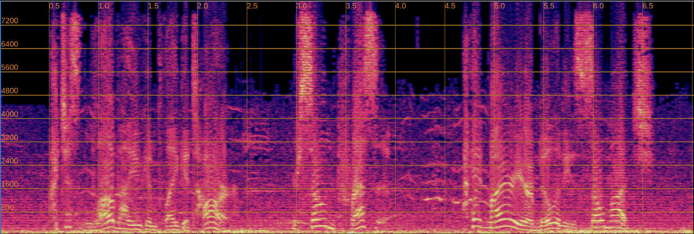
    <audio controls style="width: 100%;">
      <source src="assets/audio/input/urgent_2025.wav" type="audio/wav">
    </audio>
  

  

    <h4>Enhanced</h4>
    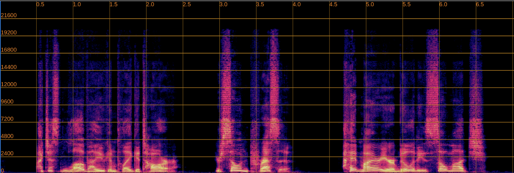
    <audio controls style="width: 100%;">
      <source src="assets/audio/enhanced/urgent_2025.wav" type="audio/wav">
    </audio>
  

## 6. Implementation Challenges and Call for Contributions

During our implementation of FINALLY, we encountered several technical challenges related to the WavLM-based perceptual loss component. Below, we present detailed descriptions of each challenge along with audio and spectrogram examples to illustrate the issues. We invite the research community to contribute solutions or alternative approaches.

### Challenge 1: Artifacts with Full Feature Projection Pipeline

When extracting WavLM features using the complete feature projection pipeline (including LayerNorm, Linear projection, and Dropout layers), we observe significant artifacts in the output spectrograms during inference.

**Technical Details:**
- WavLM convolutional feature loss: ~3.0–5.0
- STFT loss: ~0.3–0.4
- With the paper's suggested loss weights (100× for WavLM features, 1× for STFT), the WavLM component dominates the total loss
- This imbalance appears to over-constrain the model, resulting in audible artifacts and spectral distortions

**Example:**

  

    <h4>Input (Noisy)</h4>
    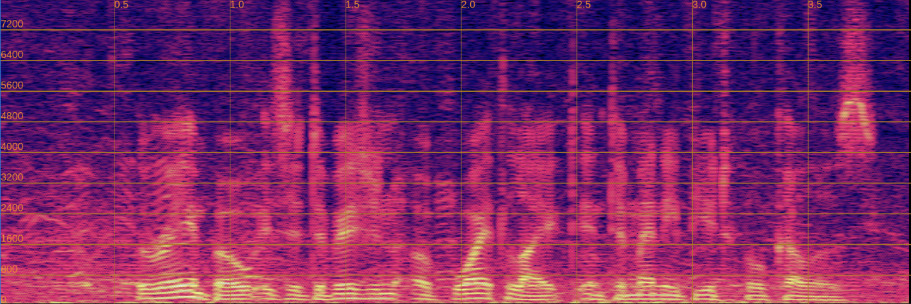
    <audio controls style="width: 100%;">
      <source src="assets/audio/input/challenge1_input.wav" type="audio/wav">
    </audio>
  

  

    <h4>Output (With Feature Projection - Artifacts Present)</h4>
    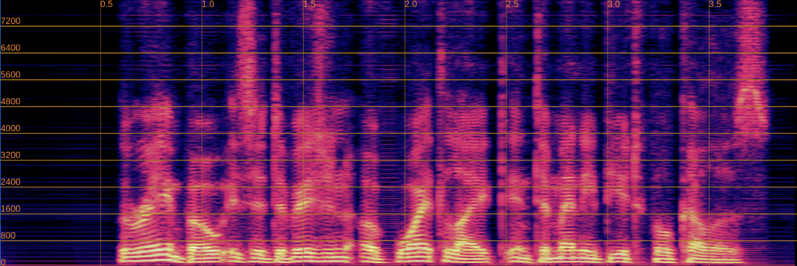
    <audio controls style="width: 100%;">
      <source src="assets/audio/enhanced/challenge1_output.wav" type="audio/wav">
    </audio>
  

### Challenge 2: Phoneme Alterations with Simplified Feature Extraction

To mitigate the artifact issue in Challenge 1, we attempted using only the convolutional encoder layers without the feature projection components. While this approach successfully eliminates artifacts from the output spectrograms, it introduces phoneme preservation issues.

**Technical Details:**
- Output spectrograms are clean and artifact-free
- However, phoneme preservation is compromised in some cases
- The model occasionally generates different phonemes than those present in the input speech
- This suggests insufficient linguistic constraint from the simplified feature space

**Example:**

  

    <h4>Input (Noisy)</h4>
    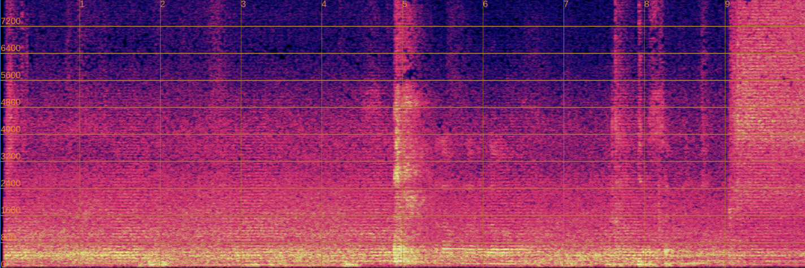
    <audio controls style="width: 100%;">
      <source src="assets/audio/input/challenge2_input.wav" type="audio/wav">
    </audio>
    
<em>Original phoneme: [example phoneme]</em>

  

  

    <h4>Output (Without Feature Projection - Phoneme Changed)</h4>
    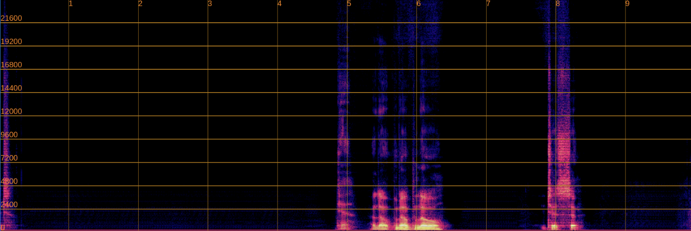
    <audio controls style="width: 100%;">
      <source src="assets/audio/enhanced/challenge2_output.wav" type="audio/wav">
    </audio>
    
<em>Altered phoneme: [changed phoneme]</em>

  

### Challenge 3: Artifacts with First Transformer Layer Features

As an alternative approach, we experimented with extracting features from the first transformer layer instead of the convolutional encoder, as the paper mentions both layers showed promising results.

**Technical Details:**
- Similar artifact patterns emerge as in Challenge 1
- The transformer layer features appear to over-constrain the model in a manner similar to the full feature projection pipeline
- This suggests the issue may be related to the feature space characteristics rather than just the projection mechanism

**Example:**

  

    <h4>Input (Noisy)</h4>
    
    <audio controls style="width: 100%;">
      <source src="assets/audio/input/challenge1_input.wav" type="audio/wav">
    </audio>
  

  

    <h4>Output (First Transformer Layer - Artifacts Present)</h4>
    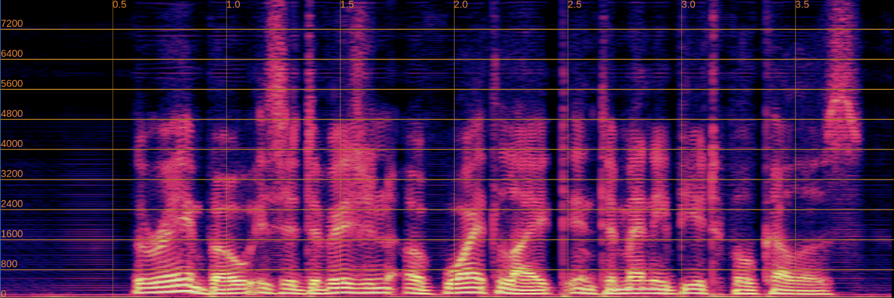
    <audio controls style="width: 100%;">
      <source src="assets/audio/enhanced/challenge3_output.wav" type="audio/wav">
    </audio>
  

### How to Contribute

We welcome contributions from the community to help resolve these challenges. If you have experience with:
- WavLM feature extraction and perceptual losses
- Speech enhancement model training and loss balancing
- Phoneme preservation techniques in generative models

Please visit our [GitHub repository](https://github.com/inverse-ai/finally-speech-enhancement) to:
- Open an issue to discuss potential solutions
- Submit a pull request with experimental results
- Share relevant research papers or techniques

Your insights and contributions could help improve the quality and robustness of this implementation.