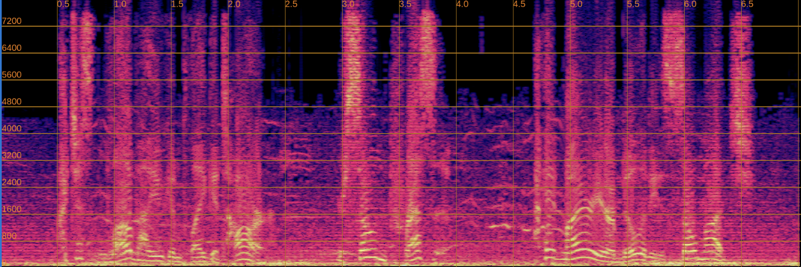
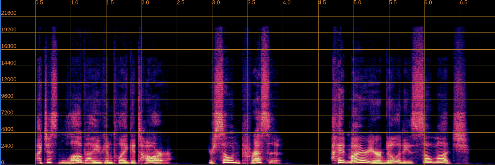

We have implemented the **FINALLY** ([NeurIPS 2024 paper](https://arxiv.org/abs/2410.05920)), a speech enhancement model designed to improve audio quality in real-world recordings, which often contain various distortions. Our implementation is publicly available on [GitHub](https://github.com/inverse-ai/finally-speech-enhancement), including datasets, augmentations, checkpoints, and demo samples. We welcome contributions to further improve the model and extend its capabilities.

## 1. Introduction

Speech enhancement in real-world environments is challenging due to a wide range of noise types, distortions, and recording conditions. FINALLY addresses these challenges by leveraging advanced feature extraction and training strategies to produce high-quality enhanced speech. The model is suitable for both offline and real-time applications and has been evaluated on several standard datasets to ensure robustness.

## 2. Datasets and Augmentations

We followed the dataset recommendations from the paper, using LibriTTS-R for the first two stages of training, DAPS-clean for stage three, and the DNS dataset for noise augmentation. Additionally, we incorporated high-quality recordings sampled at 48kHz to further improve performance, which provided a modest gain in objective metrics.

For augmentations, we extended the paper’s methodology by introducing wind noise and bandwidth limitation. The latter involved downsampling audio to 4kHz and 8kHz, followed by resampling to 16kHz or 48kHz using the model itself. Since the paper did not specify signal-to-noise ratio (SNR) ranges, we experimented with SNR values from -5 dB to 20 dB during training, which helped the model generalize better to various noise levels.

## 3. Loss Functions

We experimented with additional loss functions such as Phoemen loss and eSTOI loss. While these losses improved specific metrics, they introduced trade-offs: improving one score often led to declines in others. Ultimately, we decided to rely on the paper-suggested loss functions, with a single modification. The PESQ loss, originally weighted -2 in the paper, was instead assigned a weight of +2. This adjustment ensures proper loss reduction, aligning the optimization with our goal of minimizing perceptual error.

## 4. Feature Extraction

The paper’s analysis indicated that features derived from either the convolutional encoder or the first transformer layer of WavLM were most effective for speech enhancement. In our implementation, we selected the last convolutional layer of WavLM as the feature extractor. Using different layers resulted in noticeable differences in model performance, highlighting the importance of this choice. Proper feature selection ensures that the model captures the most relevant representations for noise reduction and speech clarity.

## 5. Evaluation and Demo

We evaluated FINALLY on the VCTK-Demand dataset. The model achieved improvements across multiple metrics, including UTMOS, DNSMOS, PESQ, STOI, and SDR. While the WV-MOS score was slightly lower than reported in the paper, the overall results demonstrate the model’s robustness in realistic conditions.

<table>
  <tr>
    <th>Metric</th>
    <td>UTMOS</td>
    <td>WV-MOS</td>
    <td>DNSMOS</td>
    <td>PESQ</td>
    <td>STOI</td>
    <td>SDR</td>
  </tr>
  <tr>
    <th>Paper’s Score</th>
    <td>4.32</td>
    <td>4.87</td>
    <td>3.22</td>
    <td>2.94</td>
    <td>0.92</td>
    <td>4.6</td>
  </tr>
  <tr>
    <th>Our Score</th>
    <td>4.30</td>
    <td>4.62</td>
    <td>3.30</td>
    <td>3.22</td>
    <td>0.95</td>
    <td>6.79</td>
  </tr>
</table>

Below, we present a side-by-side comparison of spectrograms and audio. The left column shows the input speech, while the right column shows the enhanced output.

  

    <h4>Input</h4>
    
    <audio controls style="width: 100%;">
      <source src="assets/audio/input.wav" type="audio/wav">
    </audio>
  

  

    <h4>Enhanced</h4>
    
    <audio controls style="width: 100%;">
      <source src="assets/audio/enhanced.wav" type="audio/wav">
    </audio>
  

We also applied FINALLY to real-world recordings, such as public YouTube videos, and observed noticeable improvements in clarity and intelligibility.

## 6. Challenges

Despite strong results, several challenges remain. Incorporating feature matching loss from WavLM presents a trade-off. Without it, UTMOS and PESQ scores tend to be lower, but perceptual quality appears better. With feature matching loss, objective scores improve, yet minor artifacts may appear, slightly reducing perceptual quality. Balancing quantitative metrics with perceptual quality continues to be an active area of development.

It is important to note that reference-based metrics often show low correlation with human perception, whereas no-reference metrics tend to better reflect subjective listening quality. Optimizing for metrics alone can sometimes compromise the listening experience, highlighting the need for careful evaluation across multiple dimensions.
